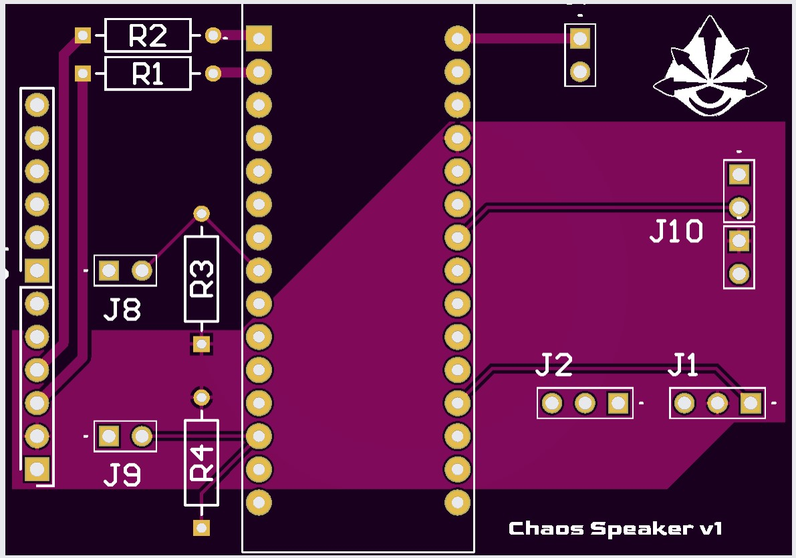
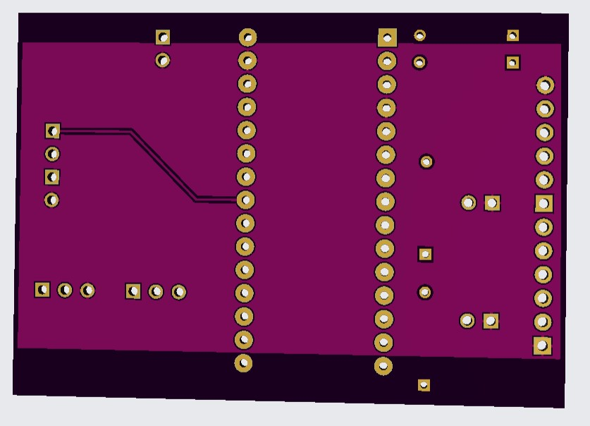

# H2ChaosSpeaker
Speaker code for Hades 2 Chaos cosplay, equipped with a slider for volume and track control, and OLED display and buttons for control.

# Materials
- Audio amplifier (this one uses SV8F Amplifier)
- 3W 4Ω Speaker (or whichever equivalent to audio amp output)
- Pontentiometer Slider
- Push button x3
- Battery Port
- 9V Battery
- OLED Screen

# PCB
For the sake of compactness and no loose wires, there is also a PCB file with the image as follows.

The PCB was designed in altium, and all the files to recreate it is in the PCB folder above.
The manufacturing was ordered on JLCPCB, by adding the Gerber Zip file within the PCB folder. 
For the manufacture methods, it should be purple silkscreen, ENIG surface finish, and remove mark for the PCB. Every other setting should be unchanged.
